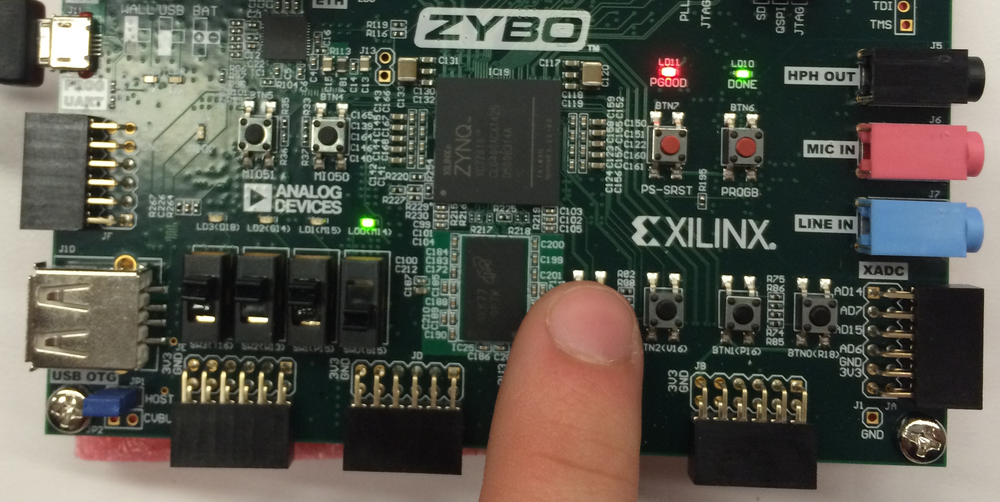

# CompArch Lab0 Write Up

## Waveform


For our single bit full adder, the worst cases are as follows:
``` 
        A   B   Cin
Sum     2   2   1
Cout    3   3   3
```

Given that our 4 bit full adder is composed of four single bit adders, the worst case is 4 * 3 = 12 gate delays = 600ns.

## Test Case Strategy

We have four test cases for each of the following groups:

- negative plus positive, which never overflows
- positive plus positive without overflow
- positive plus positive with overflow
- negative plus negative with overflow
- negative without overflow

## Test Case Failures

We never ran into test cases that resulted in an error being produced by our adder. However, when writing test cases, we thought that our overflow was not working properly. Upon further investigation, we realized that we were testing for an unsigned adder even though our adder is signed. 

## FPGA Testing

We manually ran a few of the tests from each of the test categories listed in *Test Case Strategy*. They all worked out properly, so we concluded that our FPGA adder was working properly.


First, we set A to 0b0100 = d4.


Then, we set B to 0b1110 = -d2.


We view the sum as 0b0010 = d2, as expected.


Finally, we view the carry out as true and overflow as false, as expected.

## Synthesized Design Statistics

```
Resource    Estimation  Available   Utilization
LUT         7           17600       0.04
FF          9           35200       0.03
IO          13          100         13.00
BUFG        1           32          3.13
```

For this lab, there is no valuable timing data because we didn't implement a clock. Our power and area data also do not give us much insight into our circuit because our IOs used most of the power and area. If we were to build a more substantial and complicated circuit, we would see a greater effect from our design choices.